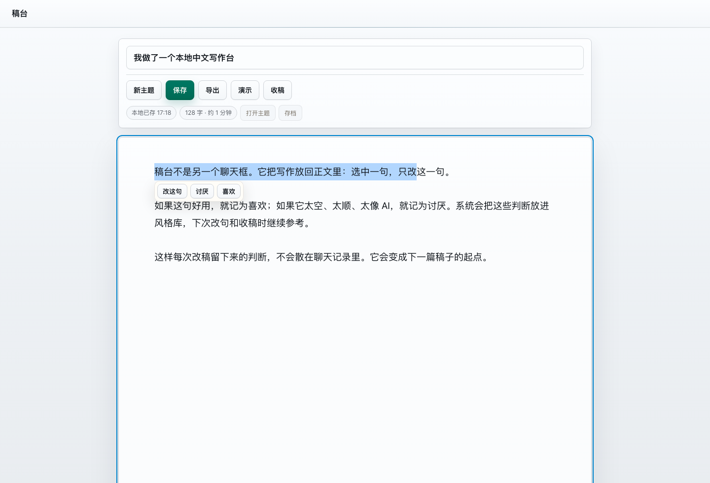

# 稿台 Gaotai

[English](README.en.md) · 中文


把 AI 写作从聊天框搬到编辑器里。

稿台是一个本地中文写作工作台。把这个仓库交给 Codex、Claude Code、Cursor Agent 或其他 coding agent，它可以帮你 clone、配置 `.env.local`、启动服务。你填自己的模型 API，打开浏览器就能写。

它不是另一张聊天窗口。稿台把长文写作拆成几个可重复的动作：选中一句改一句，遇到好表达就存进风格库，遇到空话和 AI 味就记为讨厌，写完再做收稿检查。下一次补段、改句、收稿时，这些偏好还会继续生效。

正文、版本和风格库都留在本地。中文写作可以优先接入中文表现更好的国产模型，也可以换成任何兼容 OpenAI `/chat/completions` 的 API。



## 给 Agent

```text
Clone https://github.com/xy96713-jpg/gaotai, copy .env.local.example to .env.local,
fill GAOTAI_API_KEY / GAOTAI_BASE_URL / GAOTAI_MODEL, run make workbench-start,
then open http://127.0.0.1:8766/v2/.
```

## 为什么要做

聊天框适合问问题，不适合长期改稿。写中文长文时，常见问题不是“模型完全不会写”，而是初稿看起来完整，却很难留下来：句子顺，但没动作；段落全，但重点散；这次刚提醒过的写法，下次又出现。

稿台把这些改稿动作放在同一个页面里。

| 动作 | 做什么 |
| --- | --- |
| 改句 | 选中一句，只生成这一句的候选，不重写整篇。 |
| 喜欢 | 把能留下的表达记进风格库，下次继续靠近这种写法。 |
| 讨厌 | 把空话、套话、过度解释、AI 味表达记下来，下次避开。 |
| 补段 | 在正文空白处写一句需求，让模型按上下文补一段。 |
| 收稿 | 检查病句、重复、主线脱节、口播不顺和空话，不替你自动洗稿。 |

## 写作流程

```text
整理材料 -> 写主稿 -> 选句改 -> 记喜欢/讨厌 -> 收稿 -> 导出/演示
```

风格库是这条流程的核心。它不训练模型，只保存你每次改稿时做出的判断：哪些句子能留，哪些表达以后少出现。写得越多，它越像一张你的写作偏好表。

## 模型接入

稿台默认读取 `.env.local` 里的三项配置：

```bash
GAOTAI_API_KEY=your_api_key
GAOTAI_BASE_URL=https://your-provider.example/v1
GAOTAI_MODEL=your-model-name
```

只要服务兼容 OpenAI `/chat/completions`，就可以接入。中文写作建议优先选择中文表达和长文改写更稳的模型；如果你已经有自己的网关、聚合 API 或本地模型服务，也可以直接填对应地址。

## 快速开始

```bash
git clone https://github.com/xy96713-jpg/gaotai.git
cd gaotai
cp .env.local.example .env.local
```

填好 `.env.local` 后启动：

```bash
make workbench-start
```

打开：

```text
http://127.0.0.1:8766/v2/
```

检查本地环境：

```bash
make workbench-verify
```

## 功能

- 本地浏览器写作编辑器
- 主题和版本保存
- 选句改写候选
- 喜欢 / 讨厌记录
- 风格库
- 按上下文补段
- 收稿检查
- 导出和演示模式
- 视频材料下载与分析辅助

## 项目状态

稿台现在适合个人本地写作和小范围技术用户试用。它还不是托管服务，没有账号系统、团队协作、云端同步、队列和成本控制。

公开仓库是 clean export，不包含私人草稿历史、本地缓存和 API Key。

## 项目结构

```text
inline_editor_v2/          # 写作台前端
tools/inline_editor_server.py
video_analysis_v1/         # 视频材料页
tools/                     # 本地服务、写作工具、验证脚本
tests/                     # 回归测试
.env.local.example         # API 配置模板
```

## License

MIT
