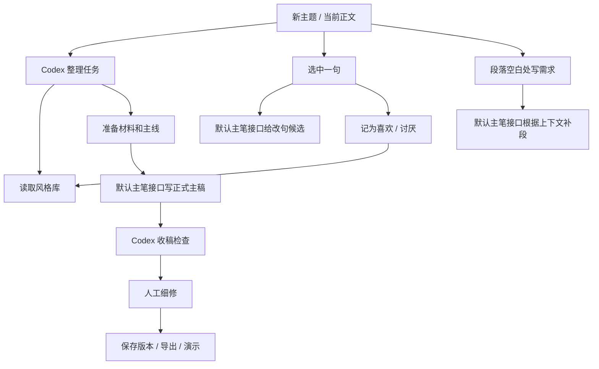

# 稿台 Gaotai

[English](README.en.md) · 中文

把 AI 写作从聊天框搬到编辑器里。

稿台是一个本地中文写作工作台。你可以把这个 GitHub 链接丢给自己的 Codex、Claude Code、Cursor Agent 或其他 coding agent，让它帮你部署。你只需要填自己的模型 API，打开浏览器就能写。

它的重点不是“一键生成一篇完整稿”，而是让你拿到初稿以后能继续改：选中一句就改这一句，喜欢的表达存起来，讨厌的表达也存起来。下次再写、补段、收稿，系统会带着这些偏好继续工作。

正文、版本、风格库都保存在本地。中文写作可以优先接入中文表现更好的国产模型，也可以换成任何兼容 OpenAI `/chat/completions` 的 API，不绑定某一家服务。

## 给 Agent

```text
Clone https://github.com/xy96713-jpg/gaotai, copy .env.local.example to .env.local,
fill GAOTAI_API_KEY / GAOTAI_BASE_URL / GAOTAI_MODEL, run make workbench-start,
then open http://127.0.0.1:8766/v2/.
```

## 为什么不是直接用聊天框

聊天框适合问问题，不适合长期改稿。

写长文时，问题通常不在“模型会不会写”，而在这些地方：

- 初稿有了，但整篇都像“能看，不能用”。
- 某一句不顺，只想改这一句，不想让模型重写全篇。
- 这次已经告诉模型“别这么写”，下次它又忘了。
- 改到最后，标题、正文、口播节奏和功能说明开始脱节。

稿台把这些动作放进同一个页面里。

| 动作 | 做什么 |
| --- | --- |
| 改句 | 选中一句，只生成这一句的候选，不打散整篇稿子。 |
| 喜欢 | 把好用的表达记进风格库，下次继续靠近这种写法。 |
| 讨厌 | 把空话、套话、过度解释、AI 味表达记下来，下次避开。 |
| 补段 | 在正文空白处写一句需求，让模型按上下文补一段。 |
| 收稿 | 检查病句、重复、主线脱节、口播不顺和空话，不替你自动洗稿。 |

## 写作流程

```text
整理材料 -> 写主稿 -> 选句改 -> 记喜欢/讨厌 -> 收稿 -> 导出/演示
```

这个流程的核心是风格库。它不是训练模型，而是把你每次改稿时做出的判断保存下来：哪些句子能留，哪些表达以后少出现。写得越多，它越像一张你的写作偏好表。

## 工作逻辑



模型分工固定：

- **Codex / 本地服务**：整理 brief、读取风格库、收稿检查、拒绝弱稿。
- **默认主笔接口**：正式主稿、局部快改、复核和补洞。使用 OpenAI-compatible API 配置。
- **旧路线**：保留给已有本地配置的人；默认部署不依赖。
- **前端**：新建主题、保存版本、选句改写、喜欢/讨厌记录、收稿、导出、演示。

## 主要功能

- `新主题`：给每篇文章建立独立主题，不和旧稿混在一起。
- `打开主题`：搜索和恢复以前写过的主题。
- `版本`：查看最近保存版本。
- 正文编辑：像普通文档一样直接写、删、改。
- 选句改写：选中一句后才出现改句动作，右侧显示候选。
- 喜欢 / 讨厌：把句子和理由写入风格库，影响后续生成和审稿。
- 补段：在正文空白处写一句需求，根据上下文补一段。
- 收稿：检查病句、重复、口播不顺、主线脱节、空话套话、功能演示是否讲清楚；不审产品能力和工程证据，不自动改正文。
- 字数和预计时长：辅助判断稿子长度。
- 演示模式：全屏口播稿，可调字号和滚动速度。
- 导出：把当前稿件导出为本地文件。

## 快速开始

```bash
git clone https://github.com/xy96713-jpg/gaotai.git
cd gaotai
cp .env.local.example .env.local
```

编辑 `.env.local`，填入自己的 Key：

```bash
GAOTAI_API_KEY=your_api_key
GAOTAI_BASE_URL=https://your-provider.example/v1
GAOTAI_MODEL=your-model-name
```

启动本地工作台：

```bash
make workbench-start
```

打开：

```text
http://127.0.0.1:8766/v2/
```

检查状态：

```bash
make workbench-status
```

健康状态里应该能看到：

- `screenRunning: true`
- `health.ok: true`
- `deepseek_configured: true`，或已通过 `GAOTAI_*` 映射到默认主笔接口

更详细的配置步骤见 [QUICKSTART.md](QUICKSTART.md)。

## 推荐使用流程

1. 点 `新主题`。
2. 写标题，保存一次。
3. 把选题、材料或初稿交给 Codex 整理。
4. 让默认主笔接口写第一版正式主稿，或把已有稿子放进编辑器。
5. 在正文里人工读稿。
6. 看到不顺的句子，选中，点改句。
7. 看到不喜欢的表达，记为讨厌。
8. 看到成立的表达，记为喜欢。
9. 段落中间缺内容，就空一行写需求，让模型按上下文补段。
10. 写完跑 `收稿`。
11. 通过后导出，或进入 `演示` 当口播稿。

## 常用命令

```bash
make workbench-start              # 启动本地服务
make workbench-restart            # 重启本地服务
make workbench-status             # 查看服务和模型配置状态
make workbench-smoke              # 基础功能 smoke test
make workbench-verify             # 本地综合验证
make workbench-final-review       # 对当前文档做收稿检查
make workbench-release-check      # 小范围内测发布门槛
make workbench-external-readiness # 检查是否适合给别人 clone 配置
make workbench-fresh-clone-smoke  # 模拟干净 clone 后的配置验证
make style-memory-hygiene         # 检查风格库卫生
```

## 当前成熟度

本项目目前适合：

- 个人本地写稿。
- 小范围给技术用户 clone 后自行配置。
- 做中文长文、视频口播稿、AI 工具类文章的写作工作流实验。
- 作为 Codex / 本地服务 + OpenAI-compatible 主笔接口的本地写作工作台模板。

目前不适合：

- 公开 SaaS。
- 多用户协作。
- 云端账号体系。
- 不懂本地服务和 API Key 的普通用户直接使用。
- 把模型输出当成无需人工判断的最终稿。

最新本地 release gate 已通过：

```text
python3 tools/workbench_release_gate.py --skip-live
结论：READY
通过：12 / 12
```

最近一次报告示例：

```text
.cache/writing/release_checks/20260627_154402/report.md
```

## 外部分享前检查

准备把仓库给别人之前，至少跑：

```bash
make workbench-external-readiness
make workbench-fresh-clone-smoke
make workbench-release-check
git status --short
```

不要提交这些内容：

- `.env.local`
- `.cache/writing/documents/`
- `.cache/writing/topic_archives/`
- 模型请求和响应缓存
- 本地 Obsidian vault
- 个人草稿、截图、导出文件

## 项目文件

- [QUICKSTART.md](QUICKSTART.md)：从 GitHub clone 后怎么配置。
- [OPEN_SOURCE_GUIDE.md](OPEN_SOURCE_GUIDE.md)：维护者如何整理、发布，以及外部用户如何部署。
- [VIDEO_ANALYSIS_USER_GUIDE.md](VIDEO_ANALYSIS_USER_GUIDE.md)：视频材料页的安装、登录态、下载、拆解和排错说明。
- [PRODUCT.md](PRODUCT.md)：产品边界、日常用法、维护和验收规则。
- [WORKBENCH_ONE_PATH_SOP.md](WORKBENCH_ONE_PATH_SOP.md)：当前最短使用 SOP。
- [AGENTS.md](AGENTS.md)：Codex 在这个工作区里的写作和执行规则。
- [CHANNEL.md](CHANNEL.md)：个人频道定位和声音约束。
- [WRITING_STAGE_GATES.md](WRITING_STAGE_GATES.md)：严肃写作的阶段门槛。
- [RELEASE_MANIFEST.md](RELEASE_MANIFEST.md)：发布和外部配置说明。
- `inline_editor_v2/`：前端页面。
- `tools/inline_editor_server.py`：本地工作台服务。
- `tools/workbench_*.py` / `tools/workbench_*.mjs`：验证、烟测、发布门槛。

## 边界

这个系统不能替你决定选题，不能替你读完所有材料，也不能保证每次一稿就好。

它真正能做的是：把材料、主线、风格记忆、局部改句、收稿检查和版本保存放进同一条流程里。这样每次改稿留下来的判断，下次还能继续用。
