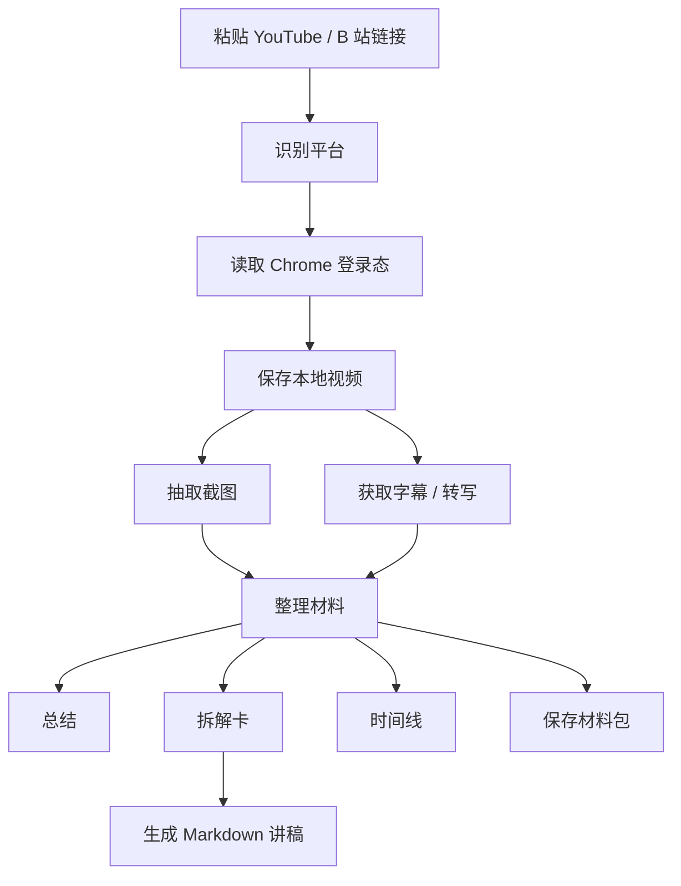

# 视频材料使用说明

`/video-analysis` 是一个本地视频材料工作台。它的目标不是做一个泛用报告页，而是把一条 YouTube 或 B 站视频先保存到本地，再拆成写作和演示能用的材料：视频、字幕、截图、时间线、拆解卡和讲稿。

当前定位：个人本地工具，小范围技术用户可用。它不是公共 SaaS，也不提供平台账号托管。

## 目录

- [功能概览](#功能概览)
- [工作方式](#工作方式)
- [环境要求](#环境要求)
- [快速开始](#快速开始)
- [登录态和下载规则](#登录态和下载规则)
- [页面怎么用](#页面怎么用)
- [结果怎么看](#结果怎么看)
- [常见失败](#常见失败)
- [验证和测试](#验证和测试)
- [隐私和边界](#隐私和边界)
- [面向开发者](#面向开发者)

## 功能概览

支持的输入：

- YouTube 视频链接
- B 站视频链接

主要输出：

- 本地视频文件
- 视频截图
- 字幕或转写材料
- 一句话结论
- 关键内容列表
- 时间线片段
- 拆解卡
- Markdown 讲稿
- 可保存的材料包

默认原则：

- 先保存视频，再拆材料。
- 能读取 Chrome 登录态时，优先使用 Chrome 登录态。
- 下载失败时停止，不伪装成已经分析完成。
- 没有字幕或截图时，明确提示材料不足。
- 不绕过平台权限、地区限制、会员限制或反机器人机制。

## 工作方式



页面不是只做“看视频”，而是把视频变成后续写作、复盘、演示能复用的素材。

## 环境要求

基础环境：

- macOS
- Python 3
- Node.js
- Google Chrome
- 可以访问 YouTube / B 站的网络环境

Python 依赖见 [requirements.txt](requirements.txt)：

```text
yt-dlp
bgutil-ytdlp-pot-provider
imageio-ffmpeg
requests
```

建议安装或确认：

```bash
python3 -m pip install -r requirements.txt
```

如果使用主写作工作台，还需要在 `.env.local` 中配置自己的 OpenAI-compatible 模型 API。单纯做视频下载和规则材料拆解时，不一定需要模型 Key。

## 快速开始

克隆仓库：

```bash
git clone https://github.com/xy96713-jpg/gaotai.git
cd gaotai
```

安装依赖：

```bash
python3 -m pip install -r requirements.txt
```

启动本地服务：

```bash
make workbench-start
```

打开视频材料页：

```text
http://127.0.0.1:8766/video-analysis
```

停止服务：

```bash
make workbench-stop
```

重启服务：

```bash
make workbench-restart
```

## 登录态和下载规则

### 为什么需要登录态

YouTube 和 B 站有些视频会要求登录、年龄确认、反机器人验证、地区校验或更严格的播放权限。浏览器里能看，不代表命令行下载器默认也能看。

本工具的处理方式是：

1. 你在 Chrome 里正常登录 YouTube 或 B 站。
2. 回到 `/video-analysis`。
3. 页面默认读取 Chrome 登录态。
4. 下载器用这个登录态尝试保存视频。

这不是把你的账号密码交给工具，也不是在页面里保存账号密码。工具只让下载器读取本机 Chrome 的登录态。

### 默认行为

页面设置里 `读取 Chrome 登录态` 默认开启。也就是说，正常点击 `下载` 时，请求会带：

```json
{
  "cookiesFromBrowser": "chrome",
  "requireLocalVideo": true
}
```

如果平台返回登录或反机器人错误，失败页会显示：

- `打开 YouTube 登录` 或 `打开 B站登录`
- `用 Chrome 登录态重跑`

推荐操作：

1. 点 `打开 YouTube 登录` 或 `打开 B站登录`。
2. 在 Chrome 里确认视频可以播放。
3. 回到工具页点 `用 Chrome 登录态重跑`。

### 什么时候仍然会失败

即使读取了 Chrome 登录态，也可能失败：

- Chrome 里这个视频本身不能播放。
- 视频需要会员、地区权限或特殊年龄验证。
- 平台临时触发反机器人机制。
- 当前网络或代理导致下载器被拒绝。
- YouTube 格式策略变化，`yt-dlp` 暂时无法拿到可下载流。
- B 站接口返回 403、404 或限流。

这种情况下，工具应该明确失败，不应该假装已经下载。

## 页面怎么用

### 1. 打开页面

```text
http://127.0.0.1:8766/video-analysis
```

首次打开应该是干净页面，不自动保留上一次任务。旧任务从 `历史` 里找。

### 2. 粘贴链接

把 YouTube 或 B 站链接放进输入框。

支持示例：

```text
https://www.youtube.com/watch?v=...
https://www.bilibili.com/video/BV...
```

### 3. 点击下载

点击 `下载` 后，页面会进入任务状态。

可能状态：

- `下载中`：正在保存视频。
- `完成`：本地视频和材料已生成。
- `失败`：没有保存成本地视频，不继续伪分析。

### 4. 查看进度

有真实下载进度时，会显示：

- 已下载大小
- 总大小
- 下载速度
- 剩余时间
- 分片进度

如果平台不返回总大小，页面不会硬造百分比，只显示已下载大小、速度或分片。

### 5. 看视频

下载成功后，视频播放器应播放本地视频。

页面会明确显示视频来源，例如：

```text
已下载到本地 · 19MB · 截图 4 张
```

如果没有本地视频，不应该显示成“原视频已可用”。

### 6. 看结论

视频下方先显示 `结论`，不是先堆报告。

结论区包括：

- 这条视频讲什么
- 关键内容
- 能写成什么
- 材料是否足够

### 7. 看拆解卡

拆解卡把视频拆成几页，每页包含：

- 时间点
- 截图
- 这一段发生了什么
- 为什么重要
- 可以直接讲的一句话

适合做：

- 产品教程拆解
- 视频复盘
- PPT 讲稿
- 内容脚本素材

### 8. 生成讲稿

点击 `生成讲稿` 后，页面会基于拆解卡生成 Markdown 讲稿。

第一版不是正式 PPT 文件，而是可编辑的 Markdown slides，方便复制到：

- Keynote
- PowerPoint
- Gamma
- Canva
- Notion
- 写作工作台

### 9. 保存材料包

任务完成后可以保存材料包。材料包通常包含：

- 原视频或视频路径
- 截图
- 字幕
- 分析结果
- 时间线
- 讲稿 Markdown

## 结果怎么看

### 下载成功

理想状态：

```text
已下载到本地 · 截图已保存 · 字幕已读取
```

这表示视频材料可以继续拆解、写稿、生成讲稿。

### 材料不足

如果页面提示材料不足，通常说明：

- 没拿到字幕
- 截图太少
- 视频内容不适合自动拆解
- 只有标题和元数据，没有足够内容

这种稿子可以当素材参考，但不建议直接交付。

### 下载失败

失败时重点看错误类型：

- `平台要求登录验证`
- `没有下载到本地视频`
- `网络或权限失败`
- `格式不可用`

失败任务不会继续假装生成完整材料。

## 常见失败

### 平台要求登录验证

现象：

```text
YouTube 要求登录或反机器人验证，本地下载被拦下。
```

处理：

1. 点 `打开 YouTube 登录`。
2. 在 Chrome 里确认你已经登录。
3. 打开原视频，确认能播放。
4. 回到工具页点 `用 Chrome 登录态重跑`。

### B 站下载失败

处理：

1. 点 `打开 B站登录` 或手动打开 B 站。
2. 确认 Chrome 已登录。
3. 确认视频可播放。
4. 回到工具页重跑。

如果仍失败，可能是视频权限、接口限流或格式问题。

### 进度看起来不动

原因可能是：

- 平台没有返回总大小。
- 下载器正在解析格式。
- 网络速度慢。
- 当前视频分片多。

页面不应该显示假的百分比。如果没有真实总量，只显示已下载大小和分片信息。

### 下载出来的文件名很奇怪

浏览器直接打开 `/api/video-analysis-file?...` 时，可能保存成类似 `video-analysis-file` 的名字。

推荐用页面里的保存入口，不要直接右键保存接口地址。正式导出应从材料包或页面按钮走。

### Chrome 已登录但仍失败

可能原因：

- 视频在 Chrome 里也不能播放。
- 平台需要额外验证。
- 登录态过期。
- 下载器被平台反机器人策略拦截。
- `yt-dlp` 需要更新。

可尝试：

```bash
python3 -m pip install -U yt-dlp bgutil-ytdlp-pot-provider
```

更新后重启：

```bash
make workbench-restart
```

## 验证和测试

静态检查：

```bash
node --check video_analysis_v1/app.js
python3 -m py_compile tools/inline_editor_server.py tools/youtube_video_notes.py
```

核心单测：

```bash
python3 -m unittest tests.test_inline_editor_server tests.test_youtube_video_notes
```

视频专项测试：

```bash
python3 -m unittest \
  tests.test_video_analysis_demo_deck_quality \
  tests.test_video_analysis_readiness \
  tests.test_video_analysis_release_gate \
  tests.test_video_analysis_sample_matrix \
  tests.test_video_analysis_live_matrix
```

登录失败页面烟测：

```bash
node tools/video_analysis_auth_failure_smoke.mjs
```

这个烟测会验证：

- 登录失败页出现平台登录入口。
- 出现 `用 Chrome 登录态重跑`。
- 重跑请求确实带 `cookiesFromBrowser: "chrome"`。

完整回归：

```bash
node tools/video_analysis_full_qa.mjs --with-sample-matrix
```

这条命令用于发版前或大改后验收。它会连续验证：

- JS 和后端语法。
- 视频材料单测。
- 打开 `/video-analysis` 时是干净入口，不自动带出上次任务。
- 下载中只显示一个进度区，不重复出现状态卡。
- 有真实总量时显示百分比、大小、速度和剩余时间。
- 没有真实总量时不造假进度条，只显示已下载大小、分片或等待时间。
- 登录/反机器人失败时停止，不继续假分析。
- 本地视频选择、拖拽上传、完成后本地播放器可用。
- 不同任务状态下的前端文案不泄漏内部规则。
- TED 样例能生成带截图的专业拆解和 PPTX。
- 样本矩阵覆盖 YouTube / B 站、本地视频、字幕缺失、失败态。

如果这条命令失败，先看：

```bash
.cache/video-analysis-full-qa/latest.json
```

其中 `results` 会记录每一步命令、耗时、stdout 和 stderr。

## 隐私和边界

### 本地文件

任务文件默认在：

```text
.cache/video-analysis/
```

这里可能包含：

- 视频文件
- 截图
- 字幕
- 任务 JSON
- 生成的讲稿

不要把 `.cache/video-analysis/` 直接提交到 GitHub。

### 账号

工具不要求你在页面里输入 YouTube 或 B 站账号密码。

推荐方式是：

```text
在 Chrome 里登录平台 -> 工具读取 Chrome 登录态 -> 下载器重跑
```

这比在工具里做账号密码输入更安全，也更符合本地工具定位。

### 法律和平台规则

这个工具只用于个人学习、研究、写作和材料整理。下载和使用视频时，需要遵守对应平台规则、版权要求和当地法律。

不要用它批量抓取、搬运、分发没有授权的视频内容。

## 面向开发者

主要文件：

- `video_analysis_v1/index.html`：视频材料页面结构。
- `video_analysis_v1/app.js`：前端状态、下载请求、任务渲染、失败处理。
- `video_analysis_v1/styles.css`：页面样式。
- `tools/inline_editor_server.py`：本地 HTTP 服务和 `/api/video-analysis-*` 接口。
- `tools/youtube_video_notes.py`：视频下载、字幕、截图、材料处理。
- `tools/video_analysis_auth_failure_smoke.mjs`：登录失败路径浏览器烟测。

主要接口：

- `POST /api/video-analysis-request`：创建下载分析任务。
- `GET /api/video-analysis-job/:id`：读取任务状态。
- `GET /api/video-analysis-jobs`：读取历史任务。
- `GET /api/video-analysis-file`：读取本地视频、截图或材料文件。
- `GET /api/video-analysis-package/:id`：导出材料包。

任务关键字段：

```json
{
  "url": "https://www.youtube.com/watch?v=...",
  "requireLocalVideo": true,
  "extractFrames": true,
  "cookiesFromBrowser": "chrome",
  "analysisBackend": "rules"
}
```

不要把 `cookiesFromBrowser` 默认改回 `none`。否则用户明明在 Chrome 登录了，下载器仍会像未登录一样失败。

## 推荐使用场景

适合：

- 视频教程拆解
- 产品 demo 复盘
- YouTube / B 站视频材料整理
- 写作前的材料准备
- PPT 或口播稿初稿

不适合：

- 公共视频下载 SaaS
- 绕过付费、会员、地区或权限限制
- 批量搬运视频
- 无人工检查的自动成稿

## 当前成熟度

当前版本已经适合个人本地使用。

比较成熟的部分：

- YouTube / B 站链接识别
- 本地视频保存优先
- Chrome 登录态重跑
- 下载失败不继续假分析
- 截图和字幕材料进入拆解卡
- Markdown 讲稿生成
- 浏览器烟测覆盖登录失败路径

仍需人工判断的部分：

- 字幕质量
- 自动总结是否准确
- 拆解卡是否抓住重点
- 讲稿是否可以直接对外发布
- 平台风控导致的下载失败

一句话：它现在可以作为本地视频材料工具使用，但不是能保证所有公开视频都 100% 下载成功的商业下载服务。
